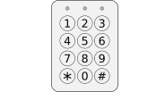
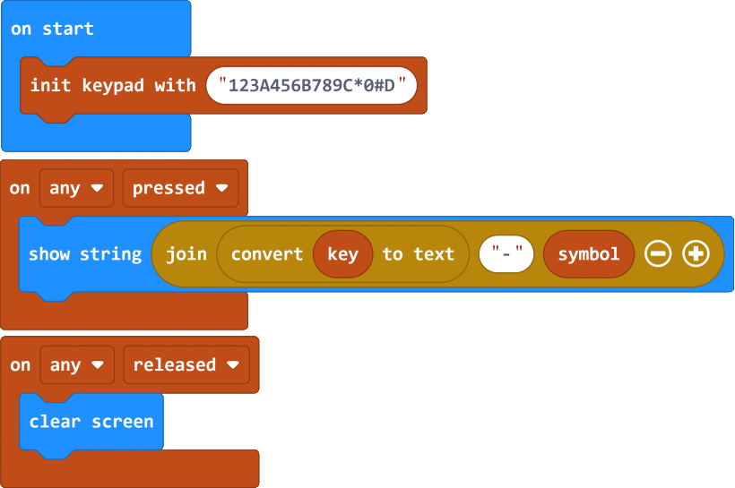

> Open this page at [https://devegied.github.io/pxt-i2c-keypad/](https://devegied.github.io/pxt-i2c-keypad)

# I2C Keypad

[](https://travis-ci.org/devegied/pxt-i2c-keypad)

makecode I2C Keypad extension for micro:bit

Matrix keypad with [custom controller](https://github.com/devegied/keypad_4x4_i2c_stm8_spl) connected to micro:bit through I2C.

Code is mostly duplicated from [MakerBit Touch extension](https://github.com/1010Technologies/pxt-makerbit-touch)



## Usage

In your micro:bit makecode project click on **Extensions** under the gearwheel menu
search for **devegied/pxt-i2c-keypad** and import

## API

```package
magicbit=github:devegied/pxt-i2c-keypad
```
```sig
initKeypadController(symbols: string)
```
```block
i2cKeypad.initKeypadController("123A456B789C*0#D")
```
Optionaly initialize the keypad controller by defining key symbols
  - symbols on keypad keys from left to right and from top to bottom expressed as a string, eg: "123A456B789C*0#D"

```sig
onKey(key: Keys, action: KeyAction, handler: () => void)
```
```block
i2cKeypad.
```
Do something when a key is pressed or released.
  - key (has a picker UI), the key to be checked, eg: Keys.K1
  - action (has a picker UI), the trigger action, eg: KeyAction.Pressed
  - handler, code to run when the event is raised

```sig
currentKey(): number
```
```block
i2cKeypad.currentKey()
```
Returns the key index of the last key event that was received. It could be either a key pressed or released event.

```sig
currentSymbol(): string
```
```block
i2cKeypad.currentSymbol()
```
Returns the key symbol of the last key event that was received. It could be either a key pressed or released event.

```sig
isPressed(keyIndex: number): boolean
```
```block
i2cKeypad.isPressed(1)
```
Returns true if a specific key is currently pressed. False otherwise.
  - keyIndex (has a picker UI), the key index to be checked 

```sig
wasPressed(): boolean
```
```block
i2cKeypad.wasPressed()
```
Returns true if any key was pressed since the last call of this function. False otherwise.

## Demo

```blocks
i2cKeypad.onKey(i2cKeypad.Keys.Any, i2cKeypad.KeyAction.Pressed, function () {
    basic.showString("" + convertToText(i2cKeypad.currentKey()) + "-" + i2cKeypad.currentSymbol())
})
i2cKeypad.onKey(i2cKeypad.Keys.Any, i2cKeypad.KeyAction.Released, function () {
    basic.clearScreen()
})
i2cKeypad.initKeypadController("123A456B789C*0#D")
```



## Blocks preview

This image shows the blocks code from the last commit in master.
This image may take a few minutes to refresh.


```cards
i2cKeypad.initKeypadController("123A456B789C*0#D")
i2cKeypad.onKey(i2cKeypad.Keys.K1, i2cKeypad.KeyAction.Pressed, () => {

})
i2cKeypad.currentKey()
i2cKeypad.currentSymbol()
i2cKeypad.isPressed(1)
wasPressed()
```

## License  

Licensed under the MIT License (MIT). See LICENSE file for more details.

Copyright (c) 2022, devegied
Copyright (c) 2020, [MakerBit](https://github.com/1010Technologies/pxt-makerbit-touch)

#### Metadata (used for search, rendering)

* for PXT/microbit

<script src="https://devegied.github.io/makecode-devegied-gh-pages-embed.js"></script><script>makeCodeRender("{{ site.makecode.home_url }}", "{{ site.github.owner_name }}/{{ site.github.repository_name }}");</script>